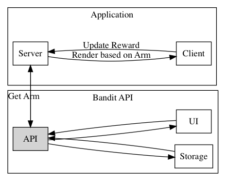

# go-bandit-server

A server running multi-armed-bandit algorithm. A redis server is required to implement caching and delayed learning.



## User Stories

### Features

#### Get Arm

- As a consumer application,
- I want to know which feature to display,
- In order to display that feature.

#### Update Arm

- As an analytic guy, 
- I want to get the feedback on the feature displayed,
- In order to improve the feature selection mechanism.

#### View Stats

- As an analytic guy,
- I want to view the current stats,
- In order to know how the features perform.

## Endpoints


### Get Arm

```bash
$ curl http://localhost:9090/arms
```

Output:

```json
{
  "arm":2,
  "id":"bcbl5jle4b3ipsuela90",
  "created_at":"2018-06-06T03:19:42.336425107Z",
  "updated_at":"2018-06-06T03:19:42.33642513Z"
}
```

### Post Arm

```bash
$ curl -X POST -d {"arm": 2, "id":"bcbl5jle4b3ipsuela90", "reward": 1} http://localhost:9090/arms
```

Output:

```json
{"ok": true}
```

### Get Arm Stats

```
$ curl http://localhost:9090/arms/stats
```

Output:

```json
{
  "counts":[0,0,1],
  "rewards":[0,0,1],
  "experiment_name":"colors",
  "features":["red","green","blue"]
}
```

## TODO

- [x] dockerize the service
- [ ] create a dashboard for the service (web ui)
- [ ] make the service configurable
- [ ] make the results of the service transparent (like feature X is n% better than feature Y)
- [ ] isolate configuration
- [ ] add labels and annotations for registry
- [ ] create sdk to integrate the functionality into other applications
- [ ] or make this into a sidecar proxy
- [ ] CRUD and API interface and CLI to integrate with the configuration
- [x] fix the race issue that is found in the api
- [ ] load data from persistent store (e.g. redis) 
- [ ] note that features might not be loaded in the correct order, hence it is important not to hardcode the values. use namespace instead